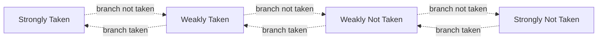

# Branch Prediction

Branch prediction in processors is used to predict whether a conditional branch is "taken" (i.e. the jump is used as the condition is met) depending on the previously seen jumps (and whether they were taken or not).

This is typically used to forward instructions, ensuring that the larger portion of instructions are forwarded when possible. However, if implemented incorrectly, the inputted instructions before the branch (i.e. those in the IF and ID stages) must be flushed to ensure that garbage instructions are not processed/written into memory.

## Method

The branch predictor was implemented using a 4-way state machine seen in the example below:

The initial state was the `Strongly Taken` state, and depending on how conditions were met in the following branches, would depend on what state we entered.

The `Strongly` states were used to allow for forwading of data (whether that be from the instructions targetted by the jump, or those directly after the jump). Whereas the `weakly` states were used to differentiate between the opposite ends of the branch predictor ensureing that we were not wasting multiple cycles of flushing data.